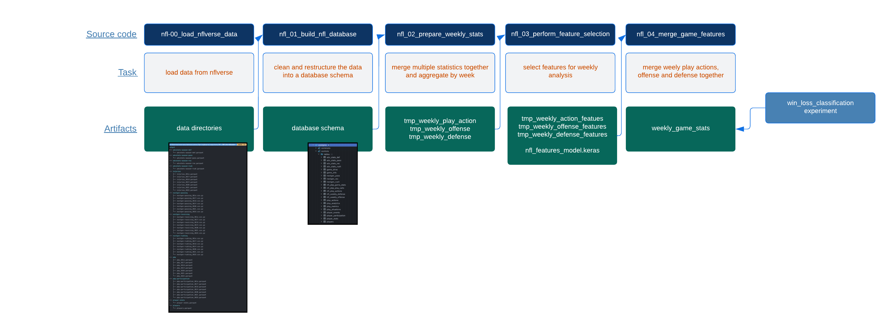
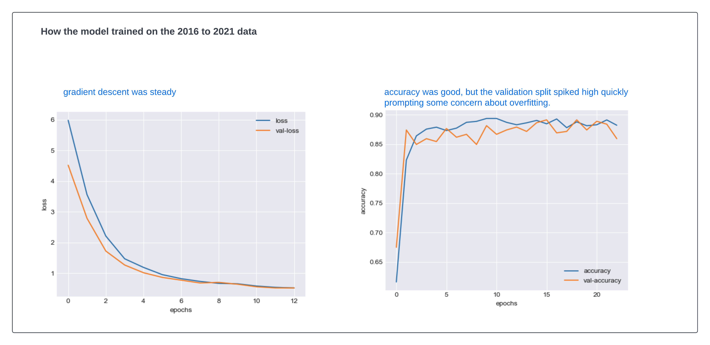
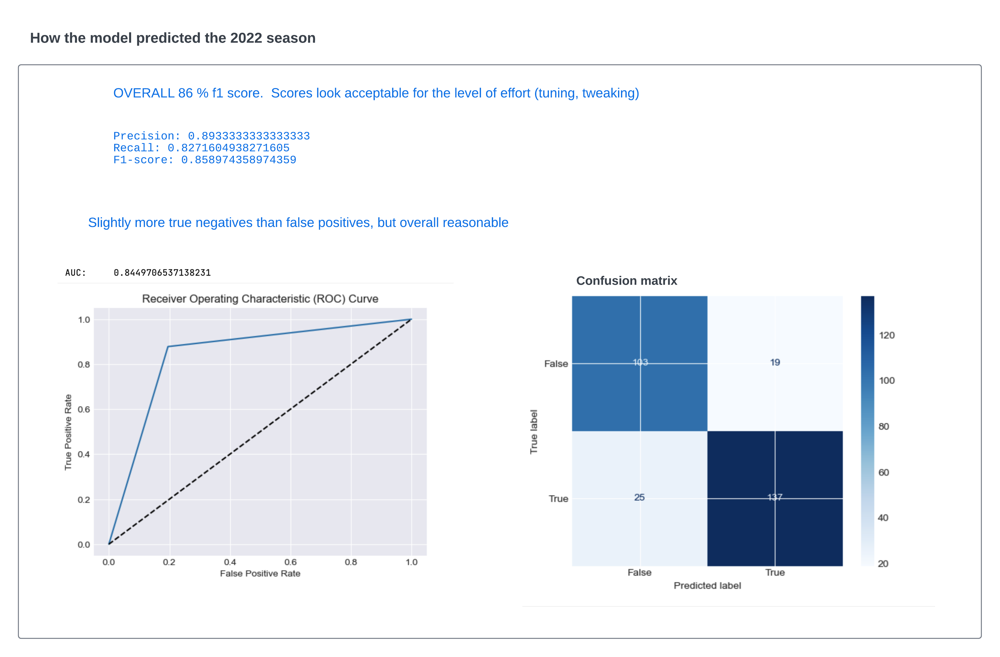

<div style="background-color: teal; padding: 10px;">
    <h3 style="color: white;">NFL Machine Learning Proof of Concept</h3>
</div>

# Table of Contents

- [Project](project.md)
- [Setup](setup.md)
- [Workflow](workflow.md)
- [Summary](summary.md)

In this write-up I'm going to share my journey to use machine learning to analyse NFL games.   I know that's a bit vague, but I'll explain. This project is more about exploration than anything else. I am fascinated with AI and machine learning, and although I'm not interested in betting on games, I am interested in the application of machine learning to real-life challenges - such as NFL sports - which is another guilty pleasure for me personally.  

I'm going to cover the following:
- Understand the data and it's limitations at a very high level
- Dig into the data and break it up into more useable (for me) datasets, so I can query for any number of experiments requiring different levels of aggregation
- Go for broke and try to use that data for predicting play calling - whether a team will pass or run based on the down, distance and field position
- If that doesn't work right away, then aggregate the data to the game level and see if I can predict wins and losses

Spoiler alert.   I was not able to predict play calling, but I was able to predict wins and losses with a reasonable level of accuracy.  I'll explain why I think that is, and what I would do differently next time.


What's my motivation?  

I was never very interested in American football until one day while watching a game it struck that in addition to the incredible physical abilities of the players, how much strategy, awareness intelligence it takes to play and coach at that high level.  In that sense, any human activity is really impressive when played at such a high level.  I was also fascinated by the fact that the game is so complex that it is difficult to predict the outcome of a game.  

The game, like any professional sport has always had a vast array of sophisticated statistical tools to analyse and predict outcomes, but there's always a 'X' factor that makes it difficult to predict.  At the same time, reinforcement learning has already been used to play games such as Go and Chess.  They do not have the physical element, but they of course have a very high level strategy, awareness and intelligence. 

So I wondered if machine learning could be used to assess a game from any number of perspectives.  Kaggle already has an annual competition - the NFL Big Data Bowl, that gets impressive submissions, and statisticians have but for this project I wanted to start from scratch and learn the data and apply some simple machine learning techniques to see if I could predict the outcome of a game with any consistent level of probability.  

I decided to use the NFLVerse data set, which is a collection of data sets that contain play by play data for every NFL game since 2016.  The data set is available from the nflverse GitHub site: https://nflverse.r-universe.dev/nflversedata.  It's a great body of data and represents the hard and smart work of a few R-language contributors.  It's obvious that a lot of time and effort has gone into providing a high quality dataset.

# The nflverse data

[GitHub repository](https://github.com/nflverse)
nflverse provides a wide variety of table and schemas ranging from a play-by-play breakdown to which officials participated in which games.  The site is large and I found it a little difficult to navigate, but the basic data can be found here [nflverse-data](https://github.com/nflverse/nflverse-data/releases).   They also provide schemas for the data, which is very helpful.  The data is provided in a wide format, which is sensible for providing the data itself, but I think needs to be transformed to perform any experiments.  I'll explain why later.

The data tht I decided to use for this initial projects was:

|data|seasons| description| schema|
| --- | --- | --- | --- | 
| pbp (play-by-play) | 2016-2022 | Play-by-play data from the nflverse package | [schema](../nflverse_schemas/dictionary_pbp.csv)|
| pbp_participation | 2016-2022 | For each play this provide the arrays of offense and defense plays on that play | [schema](../nflverse_schemas/dictionary_participation.csv)|
| player_stats | 2016-2022 | Provides statistics for each player  | [schema](../nflverse_schemas/dictionary_playerstats.csv)|
| players | 2016-2022 | Player position and ID mappings  | |
| injuries | 2016-2022 | Player injuries |[schema](../nflverse_schemas/dictionary_injuries.csv)|
| nextgen stats | 2016-2022 | Next gen stats for passing and rushing - I thought that receiving an passing would be redundant for my pupose | [schema](../nflverse_schemas/dictionary_nextgenstats.csv)|
| pfr_advstats | 2016-2022 | Advanced stats from pro-football-reference.com | |


# ETL

- configuration
- alerts
- logging
- streaming

Job focus - the idea is that downloading the files is something that should happen autonomously as an ETL job.  



There are two steps to the ETL job:

1. download the data: `read_nflverse_datasets()` - this is the main job that downloads the data from nflverse
2. create the database: `create_nfl_database()` - this job creates the database and tables

Next, we can prepare the data for experiment 2.  For that we need to aggregate the data to the game level.  We'll do this in a few steps:

3. prepare the weekly stats `prepare_team_week_dataset()` - this job merges the data into a single dataset
4. perform feature selection `perform_team_week_feature_selection()` - this job performs feature selection on the data
5. merge the features `merge_team_week_features()` - this job merges the features with the core play-by-play data

The jobs are meant to run autonomously, but for demo purposes we can manually run the ETL and feature selection jobs from:
- notebook [ETL demo notebook](notebooks/nfl_load_nflverse_data_demo.ipynb) runs each step manually end-to-end.
- notebook [Feature selection notebook](notebooks/nfl_load_nflverse_feature_selection_demo.ipynb) re-runs just the feature selection model for additional demo and charts.

The entire job is orchestrated by the nfl_main.py script, which is also meant to run autonomously, but for demo purposes we can manually run the ETL and feature selection jobs from the notebooks/nfl_load_nflverse_data_demo.ipynb notebook.

```python

def ingest_nflverse_data():
    """
    Steps to ingest the nflverse data.
    """
    read_nflverse_datasets()  # read data from nflverse
    create_nfl_database()  # clean and transform the data and create the nfl database


def prepare_team_week_data():
    """
    Steps to prepare the team-week dataset.
    """
    prepare_team_week_dataset(store_to_db=False) # merge all stats we care about int oa single dataset
    perform_team_week_feature_selection()
    merge_team_week_features()


if __name__ == '__main__':
    """ 
    Test the workflow.
    """
    ingest_nflverse_data()
    prepare_team_week_data()
```

# Reading 

[nfl_00_load_nflverse_data](https://github.com/cjlcoursework/nflverse_project/blob/c6ebaa24db6d7f3b7a3f5a755822307b2be3b23e/src/nfl_00_load_nflverse_data.py)

There's nothing fancy here.  The goal is to get the data from nflverse to my location wihtout any processing or risk that something goes wrong.  If something does go wrong at this stage the only thing we need to troubleshoot is the download itself - not any parsing or transformations.  I played with asynchronous downloads, but given the data size it was not worth the added complexity.  The data is not that big and the download is not that slow.  I just used the requests library to download the data.  I did incorporate a Thread pool executor  - but honestly I think that was more for fun than practicality.


# Database creation

- the nflverse tables are monthithic for good reason I think - it would be difficult to manage a lot of little normalized datasets
- the data is wide and sparse
- the data is not normalized
- the data is not in a format that is easy to manipulate for experimentation

The goal is not necessarily to normalize everything.  Instead, we'll separate data into separate dimensions that we can enrich as needed.

The one exception is that we restructure the pbp table more extensively.  The table is a wealth of information that contains every play for every week in every season.  It's delivered as a wide sparse table with information at different cardinality.  

for example every single play has redundant information about the season, week, game, etc.  This is fine for many cases and I won't try to over-normalize that.  In other cases there's alot of sprse data:  for example there can be a column like field_goal_result - that will be null for everyplay that was not a field_goal_attempt.   The goal is not necessarily to normalize everything.  Instead, we'll separate data into separate dimensions that we can enrich as needed.

Here is the way I dimensioned the nflverse data

<table>
  <tr>
    <td style="vertical-align: top;"><strong>table</strong></td>
    <td style="vertical-align: top;"><strong>nflverse source</strong></td>
    <td style="vertical-align: top;"><strong>description</strong></td>
  </tr>
  <tr>
    <td style="vertical-align: top;">play_actions</td>
    <td style="vertical-align: top;">pbp</td>
    <td style="vertical-align: top;">extract just the play-level 'facts' for a given game, such as drive, down, <strong>yards to go</strong> and perform minor enrichment like adding <strong>yards_to_goal</strong> by parsing yard line data</td>
  </tr>
  <tr>
    <td style="vertical-align: top;">player_participation</td>
    <td style="vertical-align: top;">player_participation</td>
    <td style="vertical-align: top;">explode player_id columns so we can join to player_events and player_stats by player_id</td>
  </tr>

  <tr>
    <td style="vertical-align: top;">play_analytics</td>
    <td style="vertical-align: top;">pbp</td>
    <td style="vertical-align: top;">extract probabilities, epa, wpa, etc. for each play</td>
  </tr>
  <tr>
    <td style="vertical-align: top;">player_events</td>
    <td style="vertical-align: top;">pbp</td>
    <td style="vertical-align: top;">within a single row there are several player events. For example: <br> - qb_hit_player_id 00001 might have sacked the QB <br> - fumble_player_id 00002 fumbled the ball <br> <br> We pull all of these out, merging with players and participation data to create a record like <br>  <font color="teal">{player_id:0002, event=fumble, team=KC, lineup=defense}</font></td>
  </tr>

  <tr>
    <td style="vertical-align: top;">game_info</td>
    <td style="vertical-align: top;">pbp</td>
    <td style="vertical-align: top;">game level information, such as teams, coaches, weather, stadium, etc, </td>
  </tr>

  <tr>
    <td style="vertical-align: top;">player_stats</td>
    <td style="vertical-align: top;">player_stats</td>
    <td style="vertical-align: top;">minor cleanup; no structural changes</td>
  </tr>

  <tr>
    <td style="vertical-align: top;">adv_stats_def<br>adv_stats_pass<br>adv_stats_rec<br>adv_stats_rush<br></td>
    <td style="vertical-align: top;">pfr_advstats ...</td>
    <td style="vertical-align: top;">minor cleanup; no structural changes</td>
  </tr>

  <tr>
    <td style="vertical-align: top;">nextgen_stats_passing<br>nextgen_stats_receiving<br>nextgen_stats_rushing</td>
    <td style="vertical-align: top;">nect_gen_stats ...</td>
    <td style="vertical-align: top;">rolled-up to the week level where they can be joined to play or game level data</td>
  </tr>

  <tr>
    <td style="vertical-align: top;">players</td>
    <td style="vertical-align: top;">players</td>
    <td style="vertical-align: top;">minor cleanup; no structural changes</td>
  </tr>
</table>


## play by play
The pbp table is a wealth of information that contains every play for every week in every season.  It's delivered as a wide sparse table with information at different cardinality.

for example every single play has redundant information about the season, week, game, etc.  This is fine for many cases and I won't try to over-normalize that.  

In other cases there's alot of sparse data: for example: a column like field_goal_result - that will be null for everyplay that was not a field_goal_attempt.   Instead, we'll separate data into separate dimensions that we can enrich as needed.

### play_actions


### player_events
within a single row there are several player events. For example:

- **qb_hit_player_id** 00001 might have sacked the QB
- **fumble_player_id 00002** fumbled the ball

We pull all of these out, merging with players and participation data to create a record like
{player_id:0002, event=fumble, team=KC, lineup=defense}
ithin a single row there are several player events. For example:

- qb_hit_player_id 00001 might have sacked the QB
- fumble_player_id 00002 fumbled the ball

We pull all of these out, merging with players and participation data to create a record like

```python
dict(player_id='0002', event='fumble', team='KC', lineup='defense')
```

<br>
For example:

For a single game between the Chiefs and the Cardinals, we can aggregate these individual records at the team level and see that there were 6 fumbles, 6 sacks, 6 qb hits, 75 tackles, 0 interceptions and 0 safeties. 

Just as important, we want two records for that single game, one from the point of view of the Chiefs and one from the point of view of the Cardinals.  This is important because we want to be able to generalize those stats to other situations by team.  We can do that by joining the player_events table to the player_participation table.  The player_participation table contains the player_id, team and lineup for each player in the game.  We can join the two tables on player_id and game_id to get the following results: 

```sql
with players as (
    select distinct game_id,  player_id, team from controls.player_participation
),
defensive_events as (
    select pe.season, pe.week, pe.game_id, pp.team, pe.player_id, pe.event, pe.lineup from controls.player_events pe
        left join players pp on (pp.player_id = pe.player_id and pp.game_id = pe.game_id)
        order by play_id 
)
SELECT
    season, week, team, game_id,
    SUM(CASE WHEN event = 'fumble' THEN 1 else 0 END) AS fumble,
    SUM(CASE WHEN event = 'safety' THEN 1 else 0 END) AS safety,
    SUM(CASE WHEN event = 'tackle' THEN 1 else 0 END) AS tackle,
    SUM(CASE WHEN event = 'qb_hit' THEN 1 else 0  END) AS qb_hit,
    SUM(CASE WHEN event = 'interception' THEN 1 else 0 END) AS interception,
    SUM(CASE WHEN event = 'sack' THEN 1 else 0 END) AS sack
FROM defensive_events where game_id = '2022_01_KC_ARI'
group by season, week, team, game_id
order by season desc, team, week;
```


| season | week | team | game\_id | fumble | safety | tackle | qb\_hit | interception | sack |
| :--- | :--- | :--- | :--- | :--- | :--- | :--- | :--- | :--- | :--- |
| 2022 | 1 | ARI | 2022\_01\_KC\_ARI | 6 | 0 | 75 | 6 | 0 | 0 |
| 2022 | 1 | KC | 2022\_01\_KC\_ARI | 6 | 0 | 60 | 6 | 0 | 3 |


### player_participation

```sql
select R.season, R.game_id, R.team, R.player_id, R.lineup,  P.display_name
from controls.player_participation R
 join controls.players P on P.player_id=R.player_id
 where R.season=2022 and game_id='2022_01_BUF_LA' and play_id='2022_01_BUF_LA_41' and lineup='defense'
 order by play_id
limit 3
```

| season | game\_id | team | player\_id | lineup | display\_name |
| :--- | :--- | :--- | :--- | :--- | :--- |
| 2022 | 2022\_01\_BUF\_LA | BUF | 00-0031787 | defense | Jake Kumerow |
| 2022 | 2022\_01\_BUF\_LA | BUF | 00-0035352 | defense | Tyrel Dodson |
| 2022 | 2022\_01\_BUF\_LA | BUF | 00-0037318 | defense | Baylon Spector |


# Feature selection

check-list:
- [x] create weekly offense and defense stats datasets by merging all stats tables into a single dataset of potential features
- [x] use sklearn and xgboost to perform feature selection, and save as a new features dataset
- [x] merge the new offense and defense features with the core play-by-play data


### create weekly offense and defense stats
For both planned experiments we want to merge several tables into a single table that we can use for feature selection.  The tables we use for the weekly and playcall experiments:

<table>
  <tr>
    <td style="vertical-align: top;"><strong>table</strong></td>
    <td style="vertical-align: top;"><strong>description</strong></td>
  </tr>
  <tr>
    <td style="vertical-align: top;">player_events</td>
    <td style="vertical-align: top;">we roll-up player events into counts (ess example above) - for example if we have 5 'sack' events in a given week for a given team we would roll them up into a 'sacks' counter = 5 for that team</td>
  </tr>
  <tr>
    <td style="vertical-align: top;">player_stats</td>
    <td style="vertical-align: top;">we also roll-up player stats into counts in the same way we do for player_events</td>
  </tr>
  <tr>
    <td style="vertical-align: top;">player_stats</td>
    <td style="vertical-align: top;">we also roll-up player stats into counts in the same way we do for player_events</td>
  </tr>
  <tr>
    <td style="vertical-align: top;">injuries</td>
    <td style="vertical-align: top;">merge an abbreviated player injury_status into weekly player stats</td>
  </tr>

  <tr>
    <td style="vertical-align: top;">game_info</td>
    <td style="vertical-align: top;">game level information, such as final scores, teams, coaches, weather, stadium, etc, </td>
  </tr>

  <tr>
    <td style="vertical-align: top;">advanced-stats</td>
    <td style="vertical-align: top;">rolled-up to the week level where they can be joined to play or game level data</td>
  </tr>

  <tr>
    <td style="vertical-align: top;">nextgen-stats</td>
    <td style="vertical-align: top;">rolled-up to the week level where they can be joined to play or game level data</td>
  </tr>

</table>


### use sklearn and xgboost to perform feature selection
in addition to a heatmap we run correlation analysis focused on just those features that are correlated with the target variable.  This is a little more involved, but the code is pretty simple.  We use the corr() function to get the correlation matrix, then we filter the matrix to just those features that are correlated with the target variable.  We then sort the features by correlation score and return the top 30 features.  We also return the top features as a set so we can use them later for feature selection.

```python
def correlate_to_target(df: pd.DataFrame, target_column: str, top_n: int) -> (pd.DataFrame, Set):
    """
    Calculate correlation coefficients to the target column
    Parameters:
        df: The DataFrame
        target_column: The target column
        top_n: The number of features to return
    Returns:
        DataFrame: The correlation coefficients
        Set: The top features
    """
    # Calculate correlation matrix
    correlation_matrix = df.corr()

    # Filter and sort correlation coefficients by absolute value
    corr_df = pd.DataFrame(correlation_matrix.abs().unstack().sort_values(ascending=False))
    corr_df.reset_index(inplace=True)
    corr_df.columns = ['x', 'y', 'corr']

    not_self_correlated = (corr_df.y != target_column)
    win_correlated = (corr_df.x == target_column)

    df = corr_df.loc[win_correlated & not_self_correlated] \
        .sort_values(by='corr', ascending=False) \
        .drop(columns=['x']) \
        .head(top_n) \
        .copy()

    s = set(df['y'].values)

    return df, s
```

example offense correlation to win/loss from [Feature selection notebook](../../notebooks/nfl_load_nflverse_feature_selection_demo.ipynb)


```python
def calc_feature_importance(X: pd.DataFrame, y: pd.Series, top_n=30) -> (pd.DataFrame, Set):
    """
    Calculate feature importance scores
    Parameters:
        X: The features
        y: The target
        top_n: The number of features to return
    Returns:
        DataFrame: The feature importance scores
        Set: The top features
    """
    # Create an XGBoost model
    model = xgb.XGBRegressor()

    # Fit the model
    model.fit(X, y)

    # Get feature importance scores
    importance_scores = model.feature_importances_

    # Sort feature importance scores
    sorted_indices = importance_scores.argsort()[::-1]
    sorted_scores = importance_scores[sorted_indices]
    feature_names = X.columns[sorted_indices]

    # Get the top 'n' feature importance scores and names
    top_scores = sorted_scores[:top_n]
    top_features = feature_names[:top_n]
    df = pd.DataFrame({'y': top_features, 'corr': top_scores})

    return df, set(top_features)
```

example offense importance from [Feature selection notebook](../../notebooks/nfl_load_nflverse_feature_selection_demo.ipynb)


### merge the new offense and defense features with the core play-by-play data

We do this in two steps:
- [x] load and merge the play_action with the offense and defense datasets we created earlier 
- [x] for experiment 2 we aggregate the weekly stats to the game level


### load and merge the play_action with the offense and defense datasets
```python
def load_and_merge_weekly_features():
    """
    Load the weekly features and merge them into a single game dataset.
    Returns:
        df (DataFrame): The merged stats data.
    """

    drop_columns = ['spread', 'target', 'opposing_team', 'opposing_coach', 'opposing_score', 'count']

    logger.info("loading weekly features into a single game dataset...")
    directory = get_config('data_directory')

    pbp_actions_df = load_file(directory,
                               get_config('action_week_prep'))

    offense_powers_df = load_file(directory,
                                  get_config('offense_week_features')).drop(columns=drop_columns)

    defense_powers_df = load_file(directory,
                                  get_config('defense_week_features')).drop(columns=drop_columns)

    logger.info("merge stats into play_actions...")

    df = merge_powers(pbp_actions_df, offense_powers_df, left_on=['season', 'week', 'home_team'],
                      renames={'offense_power': 'offense_op'}, suffixes=('_pbp', '_hop'), msg="merging offense_OP")

    df = merge_powers(df, defense_powers_df, left_on=['season', 'week', 'home_team'], suffixes=('_xx', '_hdp'),
                      renames={'defense_power': 'offense_dp'},
                      msg="merging offense_DP")

    df = merge_powers(df, offense_powers_df, left_on=['season', 'week', 'away_team'], suffixes=('_hop', '_aop'),
                      renames={'offense_power': 'defense_op'},
                      msg="merging defense_OP")

    df = merge_powers(df, defense_powers_df, left_on=['season', 'week', 'defteam'], suffixes=('_hdp', '_adp'),
                      renames={'defense_power': 'defense_dp'},
                      msg="merging defense_DP")

    assert_and_alert(pbp_actions_df.shape[0] == df.shape[0],
                     msg=f"merged row count should equal original: "
                         f"original {pbp_actions_df.shape}, "
                         f"after merge {df.shape} ")
    return df

```

### aggregate the weekly stats to the game level

```python
def aggregate_game_stats(df: DataFrame):
    """
    Aggregate the weekly stats into a single game dataset
    that has the stats for both the offense and defense for each team.

    Parameters:
        df (DataFrame): The merged weekly stats data.
    Returns:
        games_df (DataFrame): The game stats data.

    """

    logger.info("aggregate game dataset weekly stats by season, week, team...")

    # add a point spread field

    cols = df.columns.values
    # Group by season, week, game_id
    #   also by defense and offense so separate row are created for each team
    grouped_df = df.groupby(['season', 'week', 'game_id', 'home_team', 'away_team']).agg(
        drive_count=('drive', 'count'),
        carries_hop=('carries_hop', 'sum'),
        carries_aop=('carries_aop', 'sum'),
        receiving_tds_hop=('receiving_tds_hop', 'sum'),
        receiving_tds_aop=('receiving_tds_aop', 'sum'),
        passer_rating_hop=('passer_rating_hop', 'mean'),
        passer_rating_aop=('passer_rating_aop', 'mean'),
        pass_touchdowns_hop=('pass_touchdowns_hop', 'mean'),
        pass_touchdowns_aop=('pass_touchdowns_aop', 'mean'),
        special_teams_tds_hop=('special_teams_tds_hop', 'sum'),
        special_teams_tds_aop=('special_teams_tds_aop', 'sum'),
        rushing_yards_hop=('rushing_yards_hop', 'sum'),
        rushing_yards_aop=('rushing_yards_aop', 'sum'),
        rushing_tds_hop=('rushing_tds_hop', 'sum'),
        rushing_tds_aop=('rushing_tds_aop', 'sum'),
        receiving_yards_hop=('receiving_yards_hop', 'sum'),
        receiving_yards_aop=('receiving_yards_aop', 'sum'),
        receiving_air_yards_hop=('receiving_air_yards_hop', 'sum'),
        receiving_air_yards_aop=('receiving_air_yards_aop', 'sum'),
        ps_interceptions_hdp=('ps_interceptions_hdp', 'sum'),
        ps_interceptions_adp=('ps_interceptions_adp', 'sum'),
        interception_hdp=('interception_hdp', 'sum'),
        interception_adp=('interception_adp', 'sum'),
        qb_hit_hdp=('qb_hit_hdp', 'sum'),
        qb_hit_adp=('qb_hit_adp', 'sum'),
        sack_hdp=('sack_hdp', 'sum'),
        sack_adp=('sack_adp', 'sum'),
        tackle_hdp=('tackle_hdp', 'sum'),
        tackle_adp=('tackle_adp', 'sum'),
        sack_yards_hdp=('sack_yards_hdp', 'sum'),
        sack_yards_adp=('sack_yards_adp', 'sum'),
        first_downs=('down', lambda x: (x == 1).sum()),
        home_final_score=('home_final_score', 'max'),
        away_final_score=('away_final_score', 'max'),
        yards_gained=('yards_gained', 'sum'),
        pass_attempts=('pass_attempt', 'sum'),
        rush_attempts=('rush_attempt', 'sum'),
        kickoff_attempt=('kickoff_attempt', 'sum'),
        punt_attempt=('punt_attempt', 'sum'),
        field_goal_attempt=('field_goal_attempt', 'sum'),
        two_point_attempt=('two_point_attempt', 'sum'),
        extra_point_attempt=('extra_point_attempt', 'sum'),
        timeout=('timeout', 'sum'),
        penalty=('penalty', 'sum'),
        qb_spike=('qb_spike', 'sum'),
        home_team_offense_power=('offense_op', 'mean'),
        home_team_defense_power=('offense_dp', 'mean'),
        away_team_offense_power=('defense_op', 'mean'),
        away_team_defense_power=('defense_dp', 'mean')
    )

    # Reset the index to transform the grouped DataFrame back to a regular DataFrame
    grouped_df.reset_index(inplace=True)

    # Select the desired columns for the final result
    games_df = grouped_df.copy()

    # Create a new column 'loss_tie_win' based on conditions
    games_df['loss_tie_win'] = np.where(
        games_df['home_final_score'] >= games_df['away_final_score'], 1, 0)

    return games_df
```


# Experiment 1:  Predicting play calling
The goal of the play calling experiment was to predict yards and points gained based on play calling under various situations.  A simple example would be whether to punt or run a play on 4th down, based on previous stats and the situation - such as points down, yards to go, etc.

This experiment failed dismally as a network model, so I reran using AutoML and Pycaret to no joy. I immediately moved on to the simpler classification model in experiment two. 

But, during experiment two one of the key learnings was that I did not need to curate the data as much as I had.   

For example, my original assumption was that placing defensive stats like number of tackles or sacks or QB hits in the same row as offensive stats such as passer rating would confuse the model, so I attempted to roll the stats up into common offense and defense scores that were weighted averages based on the feature importance from xgboost. I then used those scores to offset offense vs defense.  This looked great in the dataset and may be statistically correct, but it was not until I just threw everything together and let the model figure it out that I began to see results.

As a next step I plan to go back and re-run this experiment with less curation.  


# Experiment 2:  Predicting wins and losses

Notebook : [Experiment 2 win/loss classification](../../notebooks/nfl_win_loss_classification.ipynb)







